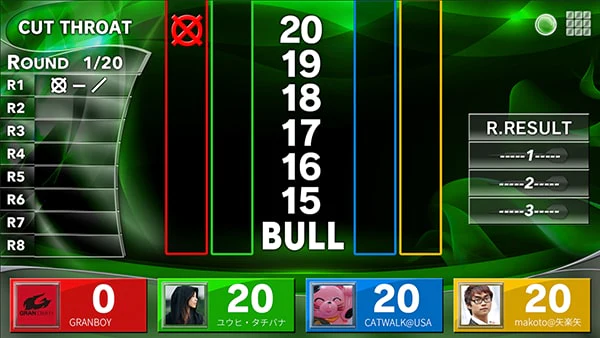

# CLAUDE.md

## Project purpose

This app powers a GranBoard-based darts scoring system. It is a Turborepo monorepo with:
- `apps/web` — React frontend (Vite + Capacitor)
- `apps/server` — Colyseus game server for online multiplayer
- `packages/engine` — Shared pure game logic (no browser/Node deps)

## Source of truth

When working on game logic, use the docs in `apps/web/docs/game-rules/` as the source of truth.
Do not invent rules from memory when a rule file exists.

## Expectations

- Keep scoring logic pure and testable.
- Add or update tests for every rule change.
- If a game rule is ambiguous, flag it in code comments or docs instead of guessing.
- Prefer shared rule utilities over per-game duplicated logic.
- Before making rules to the game logic, ask the user if the change is ok.

## Important paths

- Rules docs: `apps/web/docs/game-rules`
- Adding a new game mode: `apps/web/docs/adding-a-game-mode.md` — follow this checklist when creating a new game
- Board types: `packages/engine/src/board/Dartboard.ts` — `Segment` interface uses PascalCase properties (Value, ShortName, Type, etc.)
- Shared engine: `packages/engine/src/` — all game engines, bot logic, board geometry
- Web app: `apps/web/src/` — React UI, stores, hooks, controllers, screens
- Game server: `apps/server/src/` — Colyseus rooms, server entry

## Linting

- Use `turbo lint` from root, or `npm run lint` from `apps/web/`.

## Testing

- Use `turbo test` from root, or `npm test` from any workspace.

## Design

- The gameplay should somewhat resemble the design the Granboard App uses. This  is a good starting point.
